Insper - PADS - Atividade Integradora - Modelos Preditivos
================
Viviane Sanchez (<vivianecs2@al.insper.edu.br>), Fernando Travaglini
(<fernandotbl@al.insper.edu.br>)
4/8/2020

# 1\. Introdução

## 1.1. Objetivo

**Criar um classificador de satisfação (alta ou baixa) de clientes com
bom desempenho preditivo.**

Neste relatório serão analisados dados de entrevistas de uma pesquisa de
satisfação e qualidade percebida relativa à prestação de telefonia móvel
e banda larga móvel, na modalidade pré-paga, considerando a seguinte
questão:

  - Questão J1: Nível de satisfação geral do entrevistado com a
    prestadora citada, levando em conta toda a experiência

  - [Fonte de
    dados](http://www.dados.gov.br/dataset/banco-de-dados-da-pesquisa-telefonia-movel-pre-paga)

## 1.2. Tratamento da base

Conforme consta no enunciado do trabalho, os dados foram tratados no
Python, como descrito a seguir, para posterior modelagem no R: - Para a
variável resposta, J1, como apenas 0,15% eram dados faltantes, essas
linhas foram removidas da base - Os demais dados faltantes foram
tratados como “sem resposta” em ‘A1\_1’, ‘A1\_2’, ‘A1\_3’, ‘A1\_4’ -
Respostas do Tipo 1 foram todas padronizadas para 1: sim e 2: não - Para
facilitar a vizualização, as respostas não dadas (99) de todas as
perguntas do Tipo 2 foram substituídas por -1 - Na questão Q8, valores
NA foram substituídos pela média da idade de cada faixa - Colunas com
desvio padrão nulo, ou seja, que possuem apenas uma resposta e,
portanto, não vão influenciar os modelos, foram removidas da base para
otimizar o processamento: ‘A1\_2’, ‘Q1’, ‘Q2’, ‘Q3’, ‘Q4’, ‘Q6’, ‘Q7’ -
Optou-se por padronizar algumas respostas realizadas em momentos
diferentes e que mudam ao longo dos anos: ‘Q2’ e ‘H2’ - H2 e H2a:
respostas 999997, 999998, 999999 foram substituídas por NaN; como alguns
modelos não aceitam valores faltantes, todos eles foram susbtituídos por
0. Além disso, cerca de 6% da base teve informação de renda preenchida
pela faixa em uma nova coluna: H2b

## 1.3. Descrição

A organização, limpeza e análise gráfica foi feita em Python. A base de
dados foi então importada pelo arquivo gerado “base\_pre.csv”. A
modelagem preditiva e avaliação dos modelos aplicados foi feita em R,
neste documento. Para selecionar o melhor classificador, serão
comparados cinco modelos de classificação em uma amostra da base:
regressão logística, LASSO, KNN, floresta aleatória e boosting. Em
seguida, os modelos serão treinados e testados na base completa. O
melhor modelo será aquele com a melhor performance na base de teste e
melhor desempenho nas métricas selecionadas. Optou-se pela implementação
dos modelos com o pacote
[*tidymodels*](https://tidymodels.github.io/tidymodels/), que oferece um
framework para tratamento e análise dos dados nos diferentes modelos
aplicados neste trabalho.

## 1.4. Bibliotecas

``` r
library(tidyverse)
library(tidymodels)
library(skimr)
library(GGally)
library(vip)
library(doParallel)
```

# 2\. Dados

``` r
#getwd()
#setwd()

dados_raw <- read_csv("data/base_pre.csv")

skim(dados_raw)
```

|                                                  |            |
| :----------------------------------------------- | :--------- |
| Name                                             | dados\_raw |
| Number of rows                                   | 147783     |
| Number of columns                                | 51         |
| \_\_\_\_\_\_\_\_\_\_\_\_\_\_\_\_\_\_\_\_\_\_\_   |            |
| Column type frequency:                           |            |
| character                                        | 5          |
| Date                                             | 1          |
| numeric                                          | 45         |
| \_\_\_\_\_\_\_\_\_\_\_\_\_\_\_\_\_\_\_\_\_\_\_\_ |            |
| Group variables                                  | None       |

Data summary

**Variable type:
character**

| skim\_variable | n\_missing | complete\_rate | min | max | empty | n\_unique | whitespace |
| :------------- | ---------: | -------------: | --: | --: | ----: | --------: | ---------: |
| OPERADORA      |          0 |              1 |   2 |   9 |     0 |         7 |          0 |
| ESTADO         |          0 |              1 |   2 |   2 |     0 |        27 |          0 |
| H0             |          0 |              1 |   2 |  55 |     0 |     11829 |          0 |
| Resposta       |          0 |              1 |   4 |   5 |     0 |         2 |          0 |
| DIA\_SEMANA    |          0 |              1 |   6 |   9 |     0 |         7 |          0 |

**Variable type:
Date**

| skim\_variable | n\_missing | complete\_rate | min        | max        | median     | n\_unique |
| :------------- | ---------: | -------------: | :--------- | :--------- | :--------- | --------: |
| DATA           |          0 |              1 | 2015-01-09 | 2019-12-11 | 2017-01-08 |       500 |

**Variable type:
numeric**

| skim\_variable | n\_missing | complete\_rate |        mean |          sd |      p0 |        p25 |       p50 |         p75 |        p100 | hist  |
| :------------- | ---------: | -------------: | ----------: | ----------: | ------: | ---------: | --------: | ----------: | ----------: | :---- |
| IDTNS          |          0 |              1 | 17998671.52 | 21499164.32 |  378.00 | 2750949.00 | 6606439.0 | 40389853.50 | 62039858.00 | ▇▁▁▂▂ |
| ANO\_BASE      |          0 |              1 |     2016.63 |        1.39 | 2015.00 |    2015.00 |    2017.0 |     2018.00 |     2019.00 | ▇▆▆▅▃ |
| Q5             |          0 |              1 |        1.03 |        0.17 |    1.00 |       1.00 |       1.0 |        1.00 |        2.00 | ▇▁▁▁▁ |
| Q8             |          0 |              1 |       36.84 |       12.60 |   18.00 |      27.00 |      35.0 |       45.00 |       98.00 | ▇▆▂▁▁ |
| Q8a            |          0 |              1 |        5.44 |        1.74 |    3.00 |       4.00 |       5.0 |        7.00 |        9.00 | ▇▃▃▅▃ |
| Q9             |          0 |              1 |        1.50 |        0.50 |    1.00 |       1.00 |       1.0 |        2.00 |        2.00 | ▇▁▁▁▇ |
| J1             |          0 |              1 |        7.07 |        2.50 |    0.00 |       5.00 |       8.0 |        9.00 |       10.00 | ▂▁▅▇▆ |
| B1\_1          |          0 |              1 |        7.04 |        2.76 |  \-1.00 |       5.00 |       8.0 |        9.00 |       10.00 | ▁▁▂▃▇ |
| B1\_2          |          0 |              1 |        6.81 |        2.93 |  \-1.00 |       5.00 |       7.0 |        9.00 |       10.00 | ▂▁▂▃▇ |
| C1\_1          |          0 |              1 |        7.82 |        2.53 |  \-1.00 |       7.00 |       8.0 |       10.00 |       10.00 | ▁▁▁▂▇ |
| C1\_2          |          0 |              1 |        7.34 |        2.71 |  \-1.00 |       6.00 |       8.0 |       10.00 |       10.00 | ▁▁▂▂▇ |
| D1             |          0 |              1 |        1.45 |        0.50 |    1.00 |       1.00 |       1.0 |        2.00 |        2.00 | ▇▁▁▁▆ |
| D2\_1          |          0 |              1 |        3.17 |        4.32 |  \-1.00 |     \-1.00 |       2.0 |        7.00 |       10.00 | ▇▁▂▂▅ |
| D2\_2          |          0 |              1 |       47.76 |       46.10 |    0.00 |       7.00 |      10.0 |       99.00 |       99.00 | ▇▁▁▁▆ |
| D2\_3          |          0 |              1 |        3.09 |        4.27 |  \-1.00 |     \-1.00 |       2.0 |        7.00 |       10.00 | ▇▁▂▂▃ |
| E1\_1          |          0 |              1 |        6.84 |        2.97 |  \-1.00 |       5.00 |       8.0 |        9.00 |       10.00 | ▁▁▂▃▇ |
| E1\_2          |          0 |              1 |        6.45 |        3.25 |  \-1.00 |       5.00 |       7.0 |        9.00 |       10.00 | ▂▁▃▃▇ |
| E1\_3          |          0 |              1 |        7.75 |        2.54 |  \-1.00 |       7.00 |       8.0 |       10.00 |       10.00 | ▁▁▂▂▇ |
| A1\_1          |          0 |              1 |        1.39 |        0.49 |    1.00 |       1.00 |       1.0 |        2.00 |        2.00 | ▇▁▁▁▅ |
| A1\_2          |          0 |              1 |        1.78 |        0.42 |    1.00 |       2.00 |       2.0 |        2.00 |        2.00 | ▂▁▁▁▇ |
| A1\_3          |          0 |              1 |        1.85 |        0.36 |    1.00 |       2.00 |       2.0 |        2.00 |        2.00 | ▂▁▁▁▇ |
| A1\_4          |          0 |              1 |        1.71 |        0.45 |    1.00 |       1.00 |       2.0 |        2.00 |        2.00 | ▃▁▁▁▇ |
| A2\_1          |          0 |              1 |        2.81 |        4.08 |  \-1.00 |     \-1.00 |       0.0 |        7.00 |       10.00 | ▇▁▂▂▃ |
| A2\_2          |          0 |              1 |        3.39 |        4.30 |  \-1.00 |     \-1.00 |       3.0 |        8.00 |       10.00 | ▇▁▂▂▅ |
| A2\_3          |          0 |              1 |        3.91 |        4.57 |  \-1.00 |     \-1.00 |       5.0 |        8.00 |       10.00 | ▇▁▂▂▆ |
| A3             |          0 |              1 |        3.87 |        4.54 |  \-1.00 |     \-1.00 |       5.0 |        8.00 |       10.00 | ▇▁▂▂▆ |
| A4             |          0 |              1 |        0.80 |        3.63 |  \-1.00 |     \-1.00 |     \-1.0 |      \-1.00 |       10.00 | ▇▁▁▁▁ |
| A5             |          0 |              1 |        0.33 |        3.31 |  \-1.00 |     \-1.00 |     \-1.0 |      \-1.00 |       10.00 | ▇▁▁▁▁ |
| F1             |          0 |              1 |        1.72 |        0.45 |    1.00 |       1.00 |       2.0 |        2.00 |        2.00 | ▃▁▁▁▇ |
| F2             |          0 |              1 |        0.80 |        3.42 |  \-1.00 |     \-1.00 |     \-1.0 |        0.00 |       10.00 | ▇▁▁▁▁ |
| F3             |          0 |              1 |        1.84 |        0.37 |    1.00 |       2.00 |       2.0 |        2.00 |        2.00 | ▂▁▁▁▇ |
| F4             |          0 |              1 |      \-0.05 |        2.56 |  \-1.00 |     \-1.00 |     \-1.0 |      \-1.00 |       10.00 | ▇▁▁▁▁ |
| F5             |          0 |              1 |        1.85 |        0.35 |    1.00 |       2.00 |       2.0 |        2.00 |        2.00 | ▂▁▁▁▇ |
| F6             |          0 |              1 |      \-0.10 |        2.51 |  \-1.00 |     \-1.00 |     \-1.0 |      \-1.00 |       10.00 | ▇▁▁▁▁ |
| G1             |          0 |              1 |       14.24 |       33.13 |    1.00 |       1.00 |       1.0 |        2.00 |       99.00 | ▇▁▁▁▁ |
| COD\_IBGE      |          0 |              1 |  1004097.71 |  1928017.67 |    0.00 |       0.00 |       0.0 |  1501402.00 |  9999999.00 | ▇▂▁▁▁ |
| H1             |          0 |              1 |      239.29 |     4832.75 |    1.00 |       1.00 |       2.0 |        3.00 |    99999.00 | ▇▁▁▁▁ |
| H2             |          0 |              1 |     1469.38 |     3326.95 |    0.00 |       0.00 |     998.0 |     1800.00 |   400000.00 | ▇▁▁▁▁ |
| H2a            |          0 |              1 |        1.37 |        1.11 |    0.00 |       1.00 |       1.0 |        2.00 |        5.00 | ▇▃▁▁▁ |
| H3             |          0 |              1 |       72.58 |       42.29 |    1.00 |       7.00 |      99.0 |       99.00 |       99.00 | ▃▁▁▁▇ |
| I1             |          0 |              1 |        1.18 |        0.44 |    0.00 |       1.00 |       1.0 |        1.00 |        2.00 | ▁▁▇▁▂ |
| I2             |          0 |              1 |        0.67 |        0.65 |    0.00 |       0.00 |       1.0 |        1.00 |        2.00 | ▇▁▇▁▂ |
| PESO           |          0 |              1 |        1.00 |        1.31 |    0.01 |       0.18 |       0.6 |        1.35 |       10.97 | ▇▁▁▁▁ |
| H2b            |          0 |              1 |     1611.46 |     3332.98 |    0.00 |     500.00 |    1000.0 |     2000.00 |   400000.00 | ▇▁▁▁▁ |
| MES            |          0 |              1 |        8.38 |        2.58 |    1.00 |       8.00 |       9.0 |       10.00 |       12.00 | ▂▁▂▇▇ |

## 2.1. Variável Resposta

Para modelar a resposta adequadamente, é necessário transformá-la em
fator e remover a coluna original da base a ser analisada. Também foi
feita a transformação dos dias da semana em fator ordenado.. Optou-se
por retirar a data e o IDTNS da base nesta primeira etapa, por serem
valores exclusivos para cada linha.

``` r
dados <- dados_raw %>%
          mutate(Resposta = factor(ifelse(J1 >= 8, "Alto", "Baixo"), 
                                  levels = c("Baixo", "Alto")),
                 DIA_SEMANA = factor(dados_raw$DIA_SEMANA, levels = c('Sunday', 'Monday', 'Tuesday', 
                                                'Wednesday', 'Thursday', 'Friday', 
                                                'Saturday'),       
                                       ordered = TRUE)) %>% 
          select(-J1, -DATA, -IDTNS) #remove as colunas mencionadas
  
skim(dados$DIA_SEMANA)  
```

|                                                  |                   |
| :----------------------------------------------- | :---------------- |
| Name                                             | dados$DIA\_SEMANA |
| Number of rows                                   | 147783            |
| Number of columns                                | 1                 |
| \_\_\_\_\_\_\_\_\_\_\_\_\_\_\_\_\_\_\_\_\_\_\_   |                   |
| Column type frequency:                           |                   |
| factor                                           | 1                 |
| \_\_\_\_\_\_\_\_\_\_\_\_\_\_\_\_\_\_\_\_\_\_\_\_ |                   |
| Group variables                                  | None              |

Data summary

**Variable type:
factor**

| skim\_variable | n\_missing | complete\_rate | ordered | n\_unique | top\_counts                                    |
| :------------- | ---------: | -------------: | :------ | --------: | :--------------------------------------------- |
| data           |          0 |              1 | TRUE    |         7 | Mon: 26106, Wed: 25878, Fri: 24229, Thu: 23955 |

``` r
skim(dados$Resposta) 
```

|                                                  |                |
| :----------------------------------------------- | :------------- |
| Name                                             | dados$Resposta |
| Number of rows                                   | 147783         |
| Number of columns                                | 1              |
| \_\_\_\_\_\_\_\_\_\_\_\_\_\_\_\_\_\_\_\_\_\_\_   |                |
| Column type frequency:                           |                |
| factor                                           | 1              |
| \_\_\_\_\_\_\_\_\_\_\_\_\_\_\_\_\_\_\_\_\_\_\_\_ |                |
| Group variables                                  | None           |

Data summary

**Variable type:
factor**

| skim\_variable | n\_missing | complete\_rate | ordered | n\_unique | top\_counts            |
| :------------- | ---------: | -------------: | :------ | --------: | :--------------------- |
| data           |          0 |              1 | FALSE   |         2 | Alt: 75937, Bai: 71846 |

## 2.2. Preparação da modelagem

O pacote *tidymodels* possui uma função que separa a base em treino e
teste. A opção `strata` permite fazer essa separação de forma
proporcional para a variável ‘Resposta’ selecionada.

### 2.2.1. Treino e teste

``` r
set.seed(123)
dados_split <- initial_split(dados, prop = 0.8, strata = "Resposta")

dados_train <- training(dados_split)
dados_test <- testing(dados_split)
```

### 2.2.2. Receita

A partir do pacote *recipes*, cria-se um procedimento para processar os
dados antes da modelagem. Com a receita definida, o mesmo procedimento
pode ser aplicado facilmente a outras bases que serão processadas nos
diferentes modelos analisados.

Os seguintes passos são realizados: -`update_role`: informar ao modelo
que as colunas indicadas não devem ser consideradas como preditoras

\-`step_other`: reduzir o número de ocorrências da variável para
facilitar o processamento após a transformação em dummy

\-`step_ordinalscore`: transforma a ordem dos fatores em números

\-`step_dummy`: transformar caracteres em novas colunas com 0 ou 1

\-`step_normalize`: normalizar a base

``` r
(dados_rec <- recipe(Resposta ~ ., data = dados_train) %>%
  #update_role(IDTNS, DATA, new_role = 'ID') %>% 
  #update_role(PESO, new_role = 'weight') %>%
  step_other(ESTADO,  threshold = 0.04) %>% 
  step_other(H0, threshold = 0.01) %>%
  step_ordinalscore(DIA_SEMANA) %>% 
  step_dummy(all_nominal(), -all_outcomes()) %>%
  #step_zv(all_predictors()) %>% 
  step_normalize(all_predictors(), -DIA_SEMANA) %>% 
  prep())
```

    ## Data Recipe
    ## 
    ## Inputs:
    ## 
    ##       role #variables
    ##    outcome          1
    ##  predictor         47
    ## 
    ## Training data contained 118227 data points and no missing data.
    ## 
    ## Operations:
    ## 
    ## Collapsing factor levels for ESTADO [trained]
    ## Collapsing factor levels for H0 [trained]
    ## Scoring for DIA_SEMANA [trained]
    ## Dummy variables from OPERADORA, ESTADO, H0 [trained]
    ## Centering and scaling for ANO_BASE, Q5, Q8, Q8a, Q9, B1_1, B1_2, ... [trained]

Com a receita criada, é necessário aplicá-la aos *initial splits*
através das funções `juice` (caso particular para a base de treino) e
`bake`.

``` r
train_baked <- juice(dados_rec) 

skim(train_baked)
```

|                                                  |              |
| :----------------------------------------------- | :----------- |
| Name                                             | train\_baked |
| Number of rows                                   | 118227       |
| Number of columns                                | 64           |
| \_\_\_\_\_\_\_\_\_\_\_\_\_\_\_\_\_\_\_\_\_\_\_   |              |
| Column type frequency:                           |              |
| factor                                           | 1            |
| numeric                                          | 63           |
| \_\_\_\_\_\_\_\_\_\_\_\_\_\_\_\_\_\_\_\_\_\_\_\_ |              |
| Group variables                                  | None         |

Data summary

**Variable type:
factor**

| skim\_variable | n\_missing | complete\_rate | ordered | n\_unique | top\_counts            |
| :------------- | ---------: | -------------: | :------ | --------: | :--------------------- |
| Resposta       |          0 |              1 | FALSE   |         2 | Alt: 60750, Bai: 57477 |

**Variable type:
numeric**

| skim\_variable       | n\_missing | complete\_rate | mean |   sd |     p0 |    p25 |    p50 |    p75 |   p100 | hist  |
| :------------------- | ---------: | -------------: | ---: | ---: | -----: | -----: | -----: | -----: | -----: | :---- |
| ANO\_BASE            |          0 |              1 |  0.0 | 1.00 | \-1.17 | \-1.17 |   0.26 |   0.98 |   1.70 | ▇▆▆▅▃ |
| Q5                   |          0 |              1 |  0.0 | 1.00 | \-0.17 | \-0.17 | \-0.17 | \-0.17 |   5.75 | ▇▁▁▁▁ |
| Q8                   |          0 |              1 |  0.0 | 1.00 | \-1.49 | \-0.78 | \-0.15 |   0.64 |   4.84 | ▇▆▂▁▁ |
| Q8a                  |          0 |              1 |  0.0 | 1.00 | \-1.40 | \-0.83 | \-0.25 |   0.89 |   2.04 | ▇▃▃▅▃ |
| Q9                   |          0 |              1 |  0.0 | 1.00 | \-0.99 | \-0.99 | \-0.99 |   1.01 |   1.01 | ▇▁▁▁▇ |
| B1\_1                |          0 |              1 |  0.0 | 1.00 | \-2.91 | \-0.74 |   0.35 |   0.71 |   1.07 | ▁▁▂▃▇ |
| B1\_2                |          0 |              1 |  0.0 | 1.00 | \-2.67 | \-0.62 |   0.07 |   0.75 |   1.09 | ▂▁▂▃▇ |
| C1\_1                |          0 |              1 |  0.0 | 1.00 | \-3.50 | \-0.33 |   0.07 |   0.86 |   0.86 | ▁▁▁▂▇ |
| C1\_2                |          0 |              1 |  0.0 | 1.00 | \-3.08 | \-0.50 |   0.24 |   0.98 |   0.98 | ▁▁▂▂▇ |
| D1                   |          0 |              1 |  0.0 | 1.00 | \-0.90 | \-0.90 | \-0.90 |   1.12 |   1.12 | ▇▁▁▁▆ |
| D2\_1                |          0 |              1 |  0.0 | 1.00 | \-0.96 | \-0.96 | \-0.27 |   0.89 |   1.58 | ▇▁▂▂▅ |
| D2\_2                |          0 |              1 |  0.0 | 1.00 | \-1.04 | \-0.88 | \-0.82 |   1.11 |   1.11 | ▇▁▁▁▆ |
| D2\_3                |          0 |              1 |  0.0 | 1.00 | \-0.96 | \-0.96 | \-0.25 |   0.92 |   1.62 | ▇▁▂▂▃ |
| E1\_1                |          0 |              1 |  0.0 | 1.00 | \-2.64 | \-0.62 |   0.39 |   0.73 |   1.06 | ▁▁▂▃▇ |
| E1\_2                |          0 |              1 |  0.0 | 1.00 | \-2.29 | \-0.45 |   0.17 |   0.78 |   1.09 | ▂▁▃▃▇ |
| E1\_3                |          0 |              1 |  0.0 | 1.00 | \-3.44 | \-0.29 |   0.10 |   0.89 |   0.89 | ▁▁▂▂▇ |
| A1\_1                |          0 |              1 |  0.0 | 1.00 | \-0.80 | \-0.80 | \-0.80 |   1.25 |   1.25 | ▇▁▁▁▅ |
| A1\_2                |          0 |              1 |  0.0 | 1.00 | \-1.88 |   0.53 |   0.53 |   0.53 |   0.53 | ▂▁▁▁▇ |
| A1\_3                |          0 |              1 |  0.0 | 1.00 | \-2.35 |   0.42 |   0.42 |   0.42 |   0.42 | ▂▁▁▁▇ |
| A1\_4                |          0 |              1 |  0.0 | 1.00 | \-1.57 | \-1.57 |   0.64 |   0.64 |   0.64 | ▃▁▁▁▇ |
| A2\_1                |          0 |              1 |  0.0 | 1.00 | \-0.93 | \-0.93 | \-0.69 |   1.03 |   1.76 | ▇▁▂▂▃ |
| A2\_2                |          0 |              1 |  0.0 | 1.00 | \-1.02 | \-1.02 | \-0.09 |   1.07 |   1.54 | ▇▁▂▂▅ |
| A2\_3                |          0 |              1 |  0.0 | 1.00 | \-1.07 | \-1.07 |   0.24 |   0.89 |   1.33 | ▇▁▂▂▆ |
| A3                   |          0 |              1 |  0.0 | 1.00 | \-1.07 | \-1.07 |   0.25 |   0.91 |   1.35 | ▇▁▂▂▆ |
| A4                   |          0 |              1 |  0.0 | 1.00 | \-0.50 | \-0.50 | \-0.50 | \-0.50 |   2.53 | ▇▁▁▁▁ |
| A5                   |          0 |              1 |  0.0 | 1.00 | \-0.40 | \-0.40 | \-0.40 | \-0.40 |   2.91 | ▇▁▁▁▁ |
| F1                   |          0 |              1 |  0.0 | 1.00 | \-1.59 | \-1.59 |   0.63 |   0.63 |   0.63 | ▃▁▁▁▇ |
| F2                   |          0 |              1 |  0.0 | 1.00 | \-0.53 | \-0.53 | \-0.53 | \-0.23 |   2.69 | ▇▁▁▁▁ |
| F3                   |          0 |              1 |  0.0 | 1.00 | \-2.30 |   0.44 |   0.44 |   0.44 |   0.44 | ▂▁▁▁▇ |
| F4                   |          0 |              1 |  0.0 | 1.00 | \-0.37 | \-0.37 | \-0.37 | \-0.37 |   3.94 | ▇▁▁▁▁ |
| F5                   |          0 |              1 |  0.0 | 1.00 | \-2.41 |   0.41 |   0.41 |   0.41 |   0.41 | ▂▁▁▁▇ |
| F6                   |          0 |              1 |  0.0 | 1.00 | \-0.36 | \-0.36 | \-0.36 | \-0.36 |   4.03 | ▇▁▁▁▁ |
| G1                   |          0 |              1 |  0.0 | 1.00 | \-0.40 | \-0.40 | \-0.40 | \-0.37 |   2.56 | ▇▁▁▁▁ |
| COD\_IBGE            |          0 |              1 |  0.0 | 1.00 | \-0.52 | \-0.52 | \-0.52 |   0.26 |   4.67 | ▇▂▁▁▁ |
| H1                   |          0 |              1 |  0.0 | 1.00 | \-0.05 | \-0.05 | \-0.05 | \-0.05 |  20.71 | ▇▁▁▁▁ |
| H2                   |          0 |              1 |  0.0 | 1.00 | \-0.42 | \-0.42 | \-0.14 |   0.09 | 113.15 | ▇▁▁▁▁ |
| H2a                  |          0 |              1 |  0.0 | 1.00 | \-1.24 | \-0.34 | \-0.34 |   0.56 |   3.26 | ▃▇▅▂▁ |
| H3                   |          0 |              1 |  0.0 | 1.00 | \-1.69 | \-1.55 |   0.63 |   0.63 |   0.63 | ▃▁▁▁▇ |
| I1                   |          0 |              1 |  0.0 | 1.00 | \-2.69 | \-0.42 | \-0.42 | \-0.42 |   1.85 | ▁▁▇▁▂ |
| I2                   |          0 |              1 |  0.0 | 1.00 | \-1.03 | \-1.03 |   0.50 |   0.50 |   2.04 | ▇▁▇▁▂ |
| PESO                 |          0 |              1 |  0.0 | 1.00 | \-0.76 | \-0.63 | \-0.30 |   0.27 |   7.65 | ▇▁▁▁▁ |
| H2b                  |          0 |              1 |  0.0 | 1.00 | \-0.46 | \-0.32 | \-0.17 |   0.11 | 112.94 | ▇▁▁▁▁ |
| DIA\_SEMANA          |          0 |              1 |  4.2 | 1.78 |   1.00 |   3.00 |   4.00 |   6.00 |   7.00 | ▆▅▅▅▇ |
| MES                  |          0 |              1 |  0.0 | 1.00 | \-2.87 | \-0.15 |   0.24 |   0.63 |   1.41 | ▂▁▂▇▇ |
| OPERADORA\_CLARO     |          0 |              1 |  0.0 | 1.00 | \-0.56 | \-0.56 | \-0.56 | \-0.56 |   1.79 | ▇▁▁▁▂ |
| OPERADORA\_NEXTEL    |          0 |              1 |  0.0 | 1.00 | \-0.05 | \-0.05 | \-0.05 | \-0.05 |  18.46 | ▇▁▁▁▁ |
| OPERADORA\_OI        |          0 |              1 |  0.0 | 1.00 | \-0.57 | \-0.57 | \-0.57 | \-0.57 |   1.77 | ▇▁▁▁▂ |
| OPERADORA\_SERCOMTEL |          0 |              1 |  0.0 | 1.00 | \-0.09 | \-0.09 | \-0.09 | \-0.09 |  10.76 | ▇▁▁▁▁ |
| OPERADORA\_TIM       |          0 |              1 |  0.0 | 1.00 | \-0.56 | \-0.56 | \-0.56 | \-0.56 |   1.80 | ▇▁▁▁▂ |
| OPERADORA\_VIVO      |          0 |              1 |  0.0 | 1.00 | \-0.57 | \-0.57 | \-0.57 | \-0.57 |   1.76 | ▇▁▁▁▂ |
| ESTADO\_MG           |          0 |              1 |  0.0 | 1.00 | \-0.22 | \-0.22 | \-0.22 | \-0.22 |   4.60 | ▇▁▁▁▁ |
| ESTADO\_PR           |          0 |              1 |  0.0 | 1.00 | \-0.21 | \-0.21 | \-0.21 | \-0.21 |   4.67 | ▇▁▁▁▁ |
| ESTADO\_SP           |          0 |              1 |  0.0 | 1.00 | \-0.22 | \-0.22 | \-0.22 | \-0.22 |   4.51 | ▇▁▁▁▁ |
| ESTADO\_other        |          0 |              1 |  0.0 | 1.00 | \-2.12 |   0.47 |   0.47 |   0.47 |   0.47 | ▂▁▁▁▇ |
| H0\_BOA.VISTA        |          0 |              1 |  0.0 | 1.00 | \-0.13 | \-0.13 | \-0.13 | \-0.13 |   7.54 | ▇▁▁▁▁ |
| H0\_FORTALEZA        |          0 |              1 |  0.0 | 1.00 | \-0.10 | \-0.10 | \-0.10 | \-0.10 |   9.58 | ▇▁▁▁▁ |
| H0\_MANAUS           |          0 |              1 |  0.0 | 1.00 | \-0.14 | \-0.14 | \-0.14 | \-0.14 |   7.05 | ▇▁▁▁▁ |
| H0\_OUTRA            |          0 |              1 |  0.0 | 1.00 | \-0.69 | \-0.69 | \-0.69 |   1.45 |   1.45 | ▇▁▁▁▃ |
| H0\_RECUSA           |          0 |              1 |  0.0 | 1.00 | \-0.14 | \-0.14 | \-0.14 | \-0.14 |   7.32 | ▇▁▁▁▁ |
| H0\_RIO.BRANCO       |          0 |              1 |  0.0 | 1.00 | \-0.12 | \-0.12 | \-0.12 | \-0.12 |   8.03 | ▇▁▁▁▁ |
| H0\_RIO.DE.JANEIRO   |          0 |              1 |  0.0 | 1.00 | \-0.11 | \-0.11 | \-0.11 | \-0.11 |   8.88 | ▇▁▁▁▁ |
| H0\_SALVADOR         |          0 |              1 |  0.0 | 1.00 | \-0.10 | \-0.10 | \-0.10 | \-0.10 |   9.89 | ▇▁▁▁▁ |
| H0\_other            |          0 |              1 |  0.0 | 1.00 | \-1.13 | \-1.13 |   0.88 |   0.88 |   0.88 | ▆▁▁▁▇ |

``` r
test_baked <- bake(dados_rec, new_data = dados_test)
```

### 2.2.3. Reamostragem Cross-Validation

Com as bases separadas, o próximo passo é a criação de amostras
cross-validation para avaliar o desempenho dos modelos. Para otimizar o
processamento de comparação nos splits em cross-validation, foi
selecionada uma amostra equivalente a **30%** da base. Antes de
selecionar essa proporção, o procedimento foi realizado com amostras de
40% e 50%. Os resultados obtidos foram muito semelhantes, porém com
tempo de processamento consideravelmente maior.

``` r
set.seed(123)
(cv_splits <- train_baked %>% 
              sample_frac(0.3) %>% 
              vfold_cv(v = 5, strata = Resposta))
```

    ## #  5-fold cross-validation using stratification 
    ## # A tibble: 5 x 2
    ##   splits               id   
    ##   <named list>         <chr>
    ## 1 <split [28.4K/7.1K]> Fold1
    ## 2 <split [28.4K/7.1K]> Fold2
    ## 3 <split [28.4K/7.1K]> Fold3
    ## 4 <split [28.4K/7.1K]> Fold4
    ## 5 <split [28.4K/7.1K]> Fold5

# 3\. Modelos de Classificação

Na modelagem com o pacote *tidymodels*, é preciso fazer a especificação
dos modelos antes de seu ajuste nas amostras cross-validation. Foram
utilizadas as seguintes métricas para comparação do desempenho: área sob
a curva ROC (roc\_auc), sensibilidade (recall), especificidade (spec) e
precisão (precision). Para seleção do melhor modelo, será considerada a
maior área sob a curva ROC nos v-folds criados. As outras métricas
também serão levadas em consideração dependendo do caso.

## 3.1. Regressão Logística

A regressão logística é o modelo clássico utilizado para problemas de
classificação, portanto, será o primeiro modelo ajustado.

``` r
log_spec <- logistic_reg() %>%
            set_engine("glm") %>% 
            set_mode("classification")

log_res <- fit_resamples(Resposta ~ .,
                          log_spec,
                          cv_splits, 
                          metrics = metric_set(roc_auc, spec, recall, precision),
                          control = control_resamples(save_pred = TRUE))
```

    ## Warning: `fit_resamples.formula()` is deprecated as of lifecycle 0.1.0.
    ## The first argument to `fit_resamples()` should be either a model or a workflow. In the future, you can use:
    ## fit_resamples(log_spec, Resposta ~ ., resamples = cv_splits, 
    ##     metrics = metric_set(roc_auc, spec, recall, precision), control = control_resamples(save_pred = TRUE))
    ## This warning is displayed once every 8 hours.
    ## Call `lifecycle::last_warnings()` to see where this warning was generated.

Após o modelo ser ajustado, é possível avaliar o valor das métricas e a
matriz de confusão:

``` r
log_res %>%
  unnest(.predictions) %>%
  conf_mat(Resposta, .pred_class) %>% 
  summary()
```

    ## # A tibble: 13 x 3
    ##    .metric              .estimator .estimate
    ##    <chr>                <chr>          <dbl>
    ##  1 accuracy             binary         0.809
    ##  2 kap                  binary         0.617
    ##  3 sens                 binary         0.777
    ##  4 spec                 binary         0.839
    ##  5 ppv                  binary         0.821
    ##  6 npv                  binary         0.798
    ##  7 mcc                  binary         0.618
    ##  8 j_index              binary         0.616
    ##  9 bal_accuracy         binary         0.808
    ## 10 detection_prevalence binary         0.461
    ## 11 precision            binary         0.821
    ## 12 recall               binary         0.777
    ## 13 f_meas               binary         0.798

``` r
log_res %>%
  unnest(.predictions) %>%
  conf_mat(Resposta, .pred_class) %>% 
  autoplot()
```


## 3.2. LASSO

O modelo LASSO é conhecido por selecionar as variáveis. No entanto, é
necessário encontrar o lambda (penalty) ótimo antes de fazer o ajusta
final. Isso é feito com a criação de uma tabela indicando a quantidade
de níveis a serem testados. Para isso, foram utilizadas as funções
`grid_regular` e `tune_grid`. Para acelerar o cálculo, utiliza-se o
processamento em paralelo via *doParallel*.

``` r
lasso_spec <- multinom_reg(mode = "classification",
                          penalty = tune(), 
                          mixture = 1) %>%
  set_engine("glmnet") #false, pois a base já foi pré-processada anteriormente 

lambda_grid <- grid_regular(penalty(), levels = 50)

doParallel::registerDoParallel(cores = 6) #processamento em paralelo para otimizar

set.seed(123)
lasso_tune <- tune_grid(Resposta ~.,
  model = lasso_spec,
  resamples = cv_splits,
  metrics = metric_set(roc_auc, spec, recall, precision),
  grid = lambda_grid)
```

    ## Warning: `tune_grid.formula()` is deprecated as of lifecycle 0.1.0.
    ## The first argument to `tune_grid()` should be either a model or a workflow. In the future, you can use:
    ## tune_grid(lasso_spec, Resposta ~ ., resamples = cv_splits, grid = lambda_grid, 
    ##     metrics = metric_set(roc_auc, spec, recall, precision))
    ## This warning is displayed once every 8 hours.
    ## Call `lifecycle::last_warnings()` to see where this warning was generated.

``` r
lasso_tune %>%
  collect_metrics()
```

    ## # A tibble: 200 x 6
    ##     penalty .metric   .estimator  mean     n std_err
    ##       <dbl> <chr>     <chr>      <dbl> <int>   <dbl>
    ##  1 1.00e-10 precision binary     0.821     5 0.00271
    ##  2 1.00e-10 recall    binary     0.776     5 0.00424
    ##  3 1.00e-10 roc_auc   binary     0.887     5 0.00105
    ##  4 1.00e-10 spec      binary     0.839     5 0.00367
    ##  5 1.60e-10 precision binary     0.821     5 0.00271
    ##  6 1.60e-10 recall    binary     0.776     5 0.00424
    ##  7 1.60e-10 roc_auc   binary     0.887     5 0.00105
    ##  8 1.60e-10 spec      binary     0.839     5 0.00367
    ##  9 2.56e-10 precision binary     0.821     5 0.00271
    ## 10 2.56e-10 recall    binary     0.776     5 0.00424
    ## # … with 190 more rows

``` r
lasso_tune %>%
  collect_metrics() %>%
  #mutate(log.lambda = log(penalty)) %>% 
  ggplot(aes(penalty, mean, color = .metric)) +
  geom_errorbar(aes(
    ymin = mean - std_err,
    ymax = mean + std_err),
  alpha = 0.4) +
  geom_line(size = 1.5) +
  facet_wrap(~.metric, scales = "free") +
  scale_x_log10() +
  labs(x = 'log(lambda)') +
  theme(legend.position = "none")
```

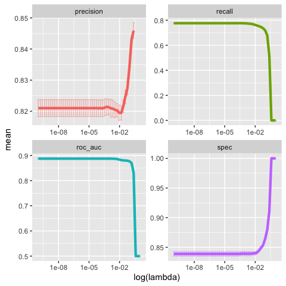

``` r
(lasso_best <- lasso_tune %>%
  select_best("roc_auc", maximize = TRUE))
```

    ## # A tibble: 1 x 1
    ##    penalty
    ##      <dbl>
    ## 1 0.000339

Com o lambda otimizado, finaliza-se o modelo:

``` r
lasso_final <- lasso_spec %>% 
  finalize_model(parameters = lasso_best)


doParallel::registerDoParallel(cores = 6)

lasso_res <- fit_resamples(Resposta ~ .,
               lasso_final,
               cv_splits,
               metrics = metric_set(roc_auc, recall, spec, precision),
               control = control_resamples(save_pred = TRUE))
    

lasso_res %>%
  unnest(.predictions) %>%
  conf_mat(Resposta, .pred_class) %>% 
  summary()
```

    ## # A tibble: 13 x 3
    ##    .metric              .estimator .estimate
    ##    <chr>                <chr>          <dbl>
    ##  1 accuracy             binary         0.808
    ##  2 kap                  binary         0.616
    ##  3 sens                 binary         0.776
    ##  4 spec                 binary         0.839
    ##  5 ppv                  binary         0.821
    ##  6 npv                  binary         0.797
    ##  7 mcc                  binary         0.617
    ##  8 j_index              binary         0.615
    ##  9 bal_accuracy         binary         0.807
    ## 10 detection_prevalence binary         0.461
    ## 11 precision            binary         0.821
    ## 12 recall               binary         0.776
    ## 13 f_meas               binary         0.798

``` r
lasso_res %>%
  unnest(.predictions) %>%
  conf_mat(Resposta, .pred_class) %>% 
  autoplot()
```


Os resultados obtidos são muito próximos aos da Regressão Logística.

## 3.3. KNN

K-Nearest Neighors (KNN) é mais um dos modelos comumente utilizados para
classificação. Seu ponto fraco, no entanto, está na possibilidade de
“overfit” dependendo da quantidade de vizinhos selecionados para o
ajuste. A seguir, serão comparados alguns modelos para encontrar o
número ótimo de vizinhos:

``` r
knn_spec <- nearest_neighbor(mode = "classification",
                             neighbors = tune()) %>%
            set_engine("kknn")

knn_grid <- grid_regular(
  neighbors(range = c(2, 500)), 
  levels = 5)
  

doParallel::registerDoParallel(cores = 5)

knn_tune <- tune_grid(Resposta ~.,
                      model = knn_spec,
                      resamples = cv_splits,
                      metrics = metric_set(roc_auc, recall, spec, precision),
                      grid = knn_grid)
```

    ## Warning: `tune_grid.formula()` is deprecated as of lifecycle 0.1.0.
    ## The first argument to `tune_grid()` should be either a model or a workflow. In the future, you can use:
    ## tune_grid(knn_spec, Resposta ~ ., resamples = cv_splits, grid = knn_grid, 
    ##     metrics = metric_set(roc_auc, recall, spec, precision))
    ## This warning is displayed once every 8 hours.
    ## Call `lifecycle::last_warnings()` to see where this warning was generated.

Avaliando os resultados, observa-se que a área sob a curva ROC, acurácia
e especificidade aumentam com o número de vizinhos, por isso o perigo em
selecionar um modelo que está “overfit”.

``` r
knn_tune %>% 
  collect_metrics()
```

    ## # A tibble: 20 x 6
    ##    neighbors .metric   .estimator  mean     n std_err
    ##        <int> <chr>     <chr>      <dbl> <int>   <dbl>
    ##  1         2 precision binary     0.699     5 0.00232
    ##  2         2 recall    binary     0.669     5 0.00226
    ##  3         2 roc_auc   binary     0.757     5 0.00133
    ##  4         2 spec      binary     0.726     5 0.00222
    ##  5       126 precision binary     0.829     5 0.00279
    ##  6       126 recall    binary     0.682     5 0.00528
    ##  7       126 roc_auc   binary     0.861     5 0.00132
    ##  8       126 spec      binary     0.866     5 0.00353
    ##  9       251 precision binary     0.832     5 0.00317
    ## 10       251 recall    binary     0.674     5 0.00480
    ## 11       251 roc_auc   binary     0.862     5 0.00135
    ## 12       251 spec      binary     0.871     5 0.00347
    ## 13       375 precision binary     0.835     5 0.00307
    ## 14       375 recall    binary     0.670     5 0.00477
    ## 15       375 roc_auc   binary     0.863     5 0.00131
    ## 16       375 spec      binary     0.874     5 0.00320
    ## 17       500 precision binary     0.838     5 0.00265
    ## 18       500 recall    binary     0.666     5 0.00431
    ## 19       500 roc_auc   binary     0.863     5 0.00128
    ## 20       500 spec      binary     0.877     5 0.00284

``` r
knn_tune %>%
  collect_metrics() %>%
  select(mean, neighbors, .metric) %>%
  #filter(.metric == 'sens') %>% 
  ggplot(aes(neighbors, mean, color = .metric)) +
  geom_point() +
  facet_wrap(~ .metric, scales = "free", nrow = 2)
```

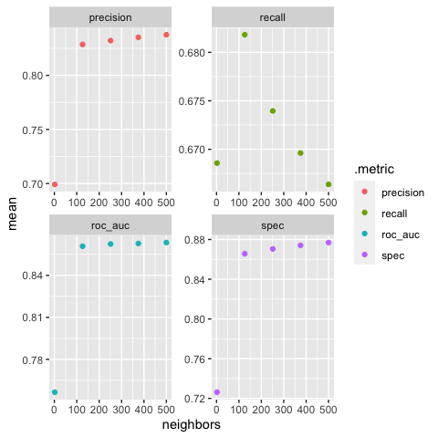

``` r
knn_best_n <- knn_tune %>%
  select_best("roc_auc", maximize = TRUE)
```

    ## Warning: The `maximize` argument is no longer needed. This value was ignored.

Se avaliarmos a sensibilidade, observa-se que ela começa a cair a partir
de k = 200. Como a diferença é muito pequena, será mantida a métrica de
área sob a curva ROC para seleção do melhor modelo.

Selecionando o melhor modelo:

``` r
knn_final <-  knn_spec %>%
    finalize_model(parameters = knn_best_n)


doParallel::registerDoParallel(cores = 5)

knn_res <- fit_resamples(Resposta ~ ., 
                          knn_final, 
                          cv_splits,
                          metrics = metric_set(roc_auc, recall, spec, precision),
                          control = control_resamples(save_pred = TRUE))
```

    ## Warning: `fit_resamples.formula()` is deprecated as of lifecycle 0.1.0.
    ## The first argument to `fit_resamples()` should be either a model or a workflow. In the future, you can use:
    ## fit_resamples(knn_final, Resposta ~ ., resamples = cv_splits, 
    ##     metrics = metric_set(roc_auc, recall, spec, precision), control = control_resamples(save_pred = TRUE))
    ## This warning is displayed once every 8 hours.
    ## Call `lifecycle::last_warnings()` to see where this warning was generated.

``` r
knn_res %>%
  unnest(.predictions) %>%
  conf_mat(Resposta, .pred_class) %>% 
  summary()
```

    ## # A tibble: 13 x 3
    ##    .metric              .estimator .estimate
    ##    <chr>                <chr>          <dbl>
    ##  1 accuracy             binary         0.774
    ##  2 kap                  binary         0.546
    ##  3 sens                 binary         0.666
    ##  4 spec                 binary         0.877
    ##  5 ppv                  binary         0.838
    ##  6 npv                  binary         0.734
    ##  7 mcc                  binary         0.557
    ##  8 j_index              binary         0.543
    ##  9 bal_accuracy         binary         0.772
    ## 10 detection_prevalence binary         0.388
    ## 11 precision            binary         0.838
    ## 12 recall               binary         0.666
    ## 13 f_meas               binary         0.742

``` r
knn_res %>%
  unnest(.predictions) %>%
  conf_mat(Resposta, .pred_class) %>% 
  autoplot()
```

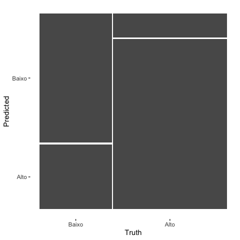

Pela matriz de confusão, observamos que o modelo tem um ótimo desempenho
na especificidade e precisão, mas perde performance na sensibilidade por
ter uma quantidade elevada de falsos negativos.

## 3.4. Random Forest

Normalmente, para florestas aleatórias de classificação, o número de
variáveis utilizadas em cada nó (mtry) é igual a sqrt(p), em que p é o
número de variáveis preditoras. Mesmo assim, será avaliado o
comportamento dos modelos em relação a esse hiperparâmetro. Tendo esse
número, será observado o desempenho do modelo também em relação ao
número de árvores. Essa calibração é feita separaadamente devido à alta
necessidade de processamento, infelizmente indisponível na máquina
local.

``` r
p <- ncol(train_baked) - 1

rf_spec <- rand_forest(mode = "classification",
                        mtry = tune(),
                        trees = 500) %>%
  set_engine("ranger", importance = "impurity")

(rf_grid <- grid_regular(
  mtry(range = c(as.integer(sqrt(p)), as.integer(p/2))),
  #trees(range = c(2000, 5000)),
  levels = 4))
```

    ## # A tibble: 4 x 1
    ##    mtry
    ##   <int>
    ## 1     7
    ## 2    15
    ## 3    23
    ## 4    31

``` r
doParallel::registerDoParallel(cores = 6) #processamento em paralelo para otimizar

set.seed(2020)
rf_tune_mtry <- tune_grid(Resposta ~.,
                      model = rf_spec,
                      resamples = cv_splits,
                      metrics = metric_set(roc_auc, recall, spec, precision),
                      grid = rf_grid)
```

    ## Warning: `tune_grid.formula()` is deprecated as of lifecycle 0.1.0.
    ## The first argument to `tune_grid()` should be either a model or a workflow. In the future, you can use:
    ## tune_grid(rf_spec, Resposta ~ ., resamples = cv_splits, grid = rf_grid, 
    ##     metrics = metric_set(roc_auc, recall, spec, precision))
    ## This warning is displayed once every 8 hours.
    ## Call `lifecycle::last_warnings()` to see where this warning was generated.

    ## i Creating pre-processing data to finalize unknown parameter: mtry

``` r
rf_tune_mtry %>%
  collect_metrics() %>%
  select(mean, mtry, .metric) %>%
  #filter(.metric == 'roc_auc') %>% 
  ggplot(aes(mtry, mean, color = .metric)) +
  geom_point(show.legend = TRUE) +
  facet_wrap(~.metric, scales = "free", nrow = 2)
```

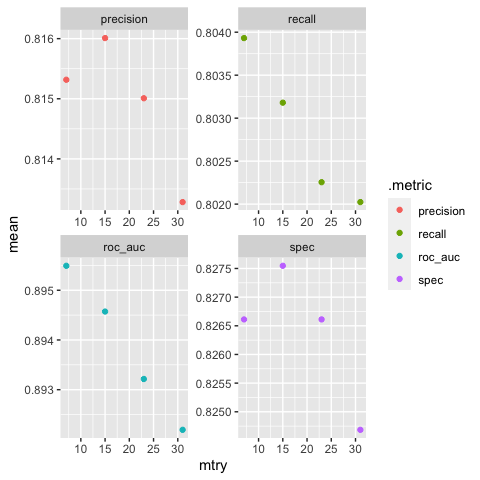

``` r
rf_best <- rf_tune_mtry %>%
    select_best("roc_auc", maximize = TRUE)
```

    ## Warning: The `maximize` argument is no longer needed. This value was ignored.

``` r
  mtry_best = rf_best$mtry
```

Conforme era esperado, medindo pela curva ROC, quanto menor o mtry,
melhor o desempenho do modelo. Considerando esse valor, será analisada a
sensibilidade em relação ao número de árvores:

``` r
rf_spec <- rand_forest(mode = "classification",
                        mtry = mtry_best,
                        trees = tune()) %>%
  set_engine("ranger", importance = "impurity")

(rf_grid <- grid_regular(
  #mtry(range = c(sqrt(p), p/2)),
  trees(range = c(50, 2000)),
  levels = 5))
```

    ## # A tibble: 5 x 1
    ##   trees
    ##   <int>
    ## 1    50
    ## 2   537
    ## 3  1025
    ## 4  1512
    ## 5  2000

``` r
doParallel::registerDoParallel(cores = 6) #processamento em paralelo para cada split

set.seed(2020)
rf_tune <- tune_grid(Resposta ~.,
                      model = rf_spec,
                      resamples = cv_splits,
                      metrics = metric_set(roc_auc, recall, spec, precision),
                      grid = rf_grid)
```

``` r
rf_tune %>%
  collect_metrics() %>%
  select(mean, trees, .metric) %>%
  #filter(.metric == 'roc_auc') %>% 
  ggplot(aes(trees, mean, color = .metric)) +
  geom_point(show.legend = TRUE) +
  facet_wrap(~.metric, scales = "free")
```

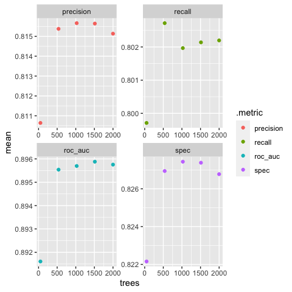

``` r
rf_best <- rf_tune %>%
    select_best("roc_auc", maximize = TRUE)
```

    ## Warning: The `maximize` argument is no longer needed. This value was ignored.

``` r
(trees_best <- rf_best$trees)
```

    ## [1] 1512

Observa-se uma melhora significativa em todas as métricas a partir de
500 árvores. Acima de 1500, no entanto, apenas a área sob a curva ROC é
beneficiada. Para otimizar um pouco o processamento, e visto que o
desempenho do modelo não é tão melhor assim com 2000 árvores, a
modelagem será feita com 1000 árvores, por ser o ponto ótimo para as
demais métricas.

Modelo final:

``` r
rf_final <-  rf_spec <- rand_forest(mode = "classification",
                        mtry = mtry_best,
                        trees = 1000) %>%
  set_engine("ranger", importance = "impurity")


doParallel::registerDoParallel(cores = 6)

rf_res <- fit_resamples(Resposta ~ .,
               rf_final,
               cv_splits,
               metrics = metric_set(roc_auc, recall, spec, precision),
               control = control_resamples(save_pred = TRUE))
```

    ## Warning: `fit_resamples.formula()` is deprecated as of lifecycle 0.1.0.
    ## The first argument to `fit_resamples()` should be either a model or a workflow. In the future, you can use:
    ## fit_resamples(rf_final, Resposta ~ ., resamples = cv_splits, 
    ##     metrics = metric_set(roc_auc, recall, spec, precision), control = control_resamples(save_pred = TRUE))
    ## This warning is displayed once every 8 hours.
    ## Call `lifecycle::last_warnings()` to see where this warning was generated.

``` r
rf_res %>%
  unnest(.predictions) %>%
  conf_mat(Resposta, .pred_class) %>% 
  summary()
```

    ## # A tibble: 13 x 3
    ##    .metric              .estimator .estimate
    ##    <chr>                <chr>          <dbl>
    ##  1 accuracy             binary         0.816
    ##  2 kap                  binary         0.631
    ##  3 sens                 binary         0.803
    ##  4 spec                 binary         0.828
    ##  5 ppv                  binary         0.816
    ##  6 npv                  binary         0.815
    ##  7 mcc                  binary         0.631
    ##  8 j_index              binary         0.631
    ##  9 bal_accuracy         binary         0.815
    ## 10 detection_prevalence binary         0.480
    ## 11 precision            binary         0.816
    ## 12 recall               binary         0.803
    ## 13 f_meas               binary         0.809

``` r
rf_res %>%
  unnest(.predictions) %>%
  conf_mat(Resposta, .pred_class) %>% 
  autoplot()
```

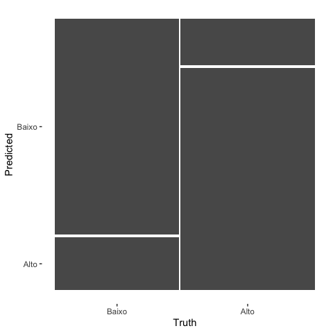

## 3.5. Boosting

Assim como na floresta aleatória, os hiperparâmetros serão analisados
separadamente. Primeiro será analisada a sensibilidade em relação ao
número de árvores e posteriormente à taxa de aprendizagem
(learning\_rate).

``` r
p <- ncol(train_baked) - 1 

boost_spec <- boost_tree(mode = "classification",
                        trees = tune()) %>%
  set_engine("xgboost", importance = "TRUE")

(boost_grid <- grid_regular(
  trees(range = c(50, 2000)),
  levels = 5))
```

    ## # A tibble: 5 x 1
    ##   trees
    ##   <int>
    ## 1    50
    ## 2   537
    ## 3  1025
    ## 4  1512
    ## 5  2000

``` r
doParallel::registerDoParallel(cores = 6) #processamento em paralelo para otimizar

set.seed(2020)
boost_tune_trees <- tune_grid(Resposta ~.,
                      model = boost_spec,
                      resamples = cv_splits,
                      metrics = metric_set(roc_auc, recall, spec, precision),
                      grid = boost_grid)
```

    ## Warning: `tune_grid.formula()` is deprecated as of lifecycle 0.1.0.
    ## The first argument to `tune_grid()` should be either a model or a workflow. In the future, you can use:
    ## tune_grid(boost_spec, Resposta ~ ., resamples = cv_splits, grid = boost_grid, 
    ##     metrics = metric_set(roc_auc, recall, spec, precision))
    ## This warning is displayed once every 8 hours.
    ## Call `lifecycle::last_warnings()` to see where this warning was generated.

Análise dos hiperparâmetros

``` r
boost_tune_trees %>%
  collect_metrics() %>%
  ggplot(aes(trees, mean, color = .metric)) +
  geom_point(show.legend = TRUE) +
  facet_wrap(~.metric, scales = "free", nrow = 2)
```

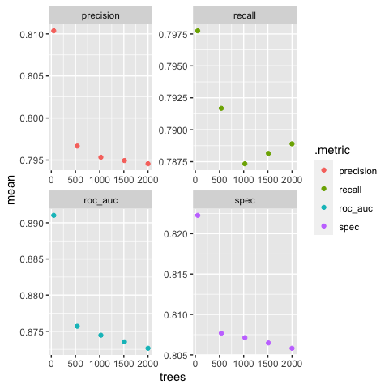

``` r
boost_tune_trees %>%
  show_best("roc_auc")
```

    ## # A tibble: 5 x 6
    ##   trees .metric .estimator  mean     n  std_err
    ##   <int> <chr>   <chr>      <dbl> <int>    <dbl>
    ## 1    50 roc_auc binary     0.891     5 0.000839
    ## 2   537 roc_auc binary     0.876     5 0.000676
    ## 3  1025 roc_auc binary     0.874     5 0.000693
    ## 4  1512 roc_auc binary     0.874     5 0.000991
    ## 5  2000 roc_auc binary     0.873     5 0.000953

``` r
  boost_best <- boost_tune_trees %>%
    select_best("roc_auc", maximize = TRUE)
```

    ## Warning: The `maximize` argument is no longer needed. This value was ignored.

``` r
  trees_boost <- boost_best$trees
```

A melhor resposta para a curva ROC e para as demais métricas se deu com
o menor número de árvores. A seguir, será avaliada a taxa de
aprendizagem do modelo.

``` r
boost_spec <- boost_tree(mode = "classification",
                        trees = trees_boost,
                        learn_rate = tune()) %>%
  set_engine("xgboost", importance = "TRUE")


(boost_grid <- grid_regular(
  learn_rate(range = c(-5, 0.5)),
  levels = 5))
```

    ## # A tibble: 5 x 1
    ##   learn_rate
    ##        <dbl>
    ## 1   0.00001 
    ## 2   0.000237
    ## 3   0.00562 
    ## 4   0.133   
    ## 5   3.16

``` r
doParallel::registerDoParallel(cores = 6) #processamento em paralelo para otimizar

set.seed(2020)
boost_tune <- tune_grid(Resposta ~.,
                      model = boost_spec,
                      resamples = cv_splits,
                      metrics = metric_set(roc_auc, recall, spec, precision),
                      grid = boost_grid)
```

``` r
boost_tune %>%
  collect_metrics() %>%
  ggplot(aes(learn_rate, mean, color = .metric)) +
  geom_point(show.legend = TRUE) +
  scale_x_log10() +
  facet_wrap(~.metric, scales = "free", nrow = 2)
```

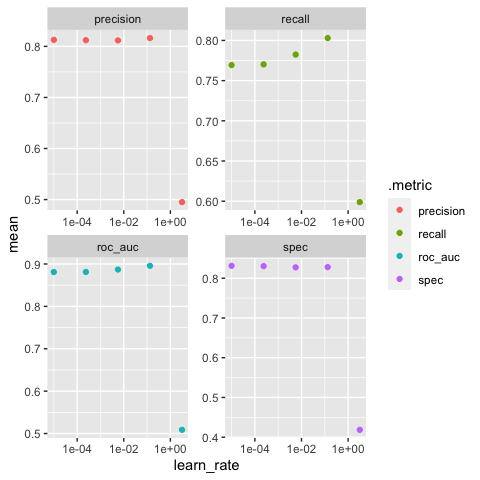

``` r
boost_tune %>%
  show_best("roc_auc")
```

    ## # A tibble: 5 x 6
    ##   learn_rate .metric .estimator  mean     n  std_err
    ##        <dbl> <chr>   <chr>      <dbl> <int>    <dbl>
    ## 1   0.133    roc_auc binary     0.896     5 0.000634
    ## 2   0.00562  roc_auc binary     0.887     5 0.00116 
    ## 3   0.000237 roc_auc binary     0.881     5 0.00186 
    ## 4   0.00001  roc_auc binary     0.881     5 0.00175 
    ## 5   3.16     roc_auc binary     0.509     5 0.00547

``` r
  boost_best <- boost_tune %>%
    select_best("roc_auc", maximize = TRUE)
```

    ## Warning: The `maximize` argument is no longer needed. This value was ignored.

Modelo final

``` r
boost_final <-  boost_spec %>%
    finalize_model(parameters = boost_best)


doParallel::registerDoParallel(cores = 6)

boost_res <- fit_resamples(Resposta ~ .,
               boost_final,
               cv_splits,
               metrics = metric_set(roc_auc, recall, spec, precision),
               control = control_resamples(save_pred = TRUE))
```

    ## Warning: `fit_resamples.formula()` is deprecated as of lifecycle 0.1.0.
    ## The first argument to `fit_resamples()` should be either a model or a workflow. In the future, you can use:
    ## fit_resamples(boost_final, Resposta ~ ., resamples = cv_splits, 
    ##     metrics = metric_set(roc_auc, recall, spec, precision), control = control_resamples(save_pred = TRUE))
    ## This warning is displayed once every 8 hours.
    ## Call `lifecycle::last_warnings()` to see where this warning was generated.

``` r
boost_res %>%
  unnest(.predictions) %>%
  conf_mat(Resposta, .pred_class) %>% 
  summary()
```

    ## # A tibble: 13 x 3
    ##    .metric              .estimator .estimate
    ##    <chr>                <chr>          <dbl>
    ##  1 accuracy             binary         0.816
    ##  2 kap                  binary         0.631
    ##  3 sens                 binary         0.803
    ##  4 spec                 binary         0.828
    ##  5 ppv                  binary         0.816
    ##  6 npv                  binary         0.815
    ##  7 mcc                  binary         0.631
    ##  8 j_index              binary         0.631
    ##  9 bal_accuracy         binary         0.815
    ## 10 detection_prevalence binary         0.480
    ## 11 precision            binary         0.816
    ## 12 recall               binary         0.803
    ## 13 f_meas               binary         0.810

``` r
boost_res %>%
  unnest(.predictions) %>%
  conf_mat(Resposta, .pred_class) %>% 
  autoplot()
```


# 4\. Resultados

## 4.1. Desempenho nos v-folds:

``` r
cv_res <- log_res %>% 
  unnest(.metrics) %>% 
  mutate(model = "logistica") %>% 
  bind_rows(knn_res %>% 
            unnest(.metrics) %>% 
            mutate(model = "knn")) %>% 
   bind_rows(lasso_res %>% 
            unnest(.metrics) %>% 
            mutate(model = "lasso")) %>% 
    bind_rows(rf_res %>% 
            unnest(.metrics) %>% 
            mutate(model = "rf")) %>% 
  bind_rows(boost_res %>% 
            unnest(.metrics) %>% 
            mutate(model = "boost")) 

cv_res %>% 
  ggplot(aes(id, .estimate, group = model, color = model)) + 
  geom_point(size = 1) + 
  #geom_hline(yintercept = mean(cv_res$.estimate), group = model, size = 1, alpha = 0.5) +
  geom_line(size = 1, alpha = 0.5) +
  facet_wrap(~.metric, scales = "free") + 
  coord_flip()
```

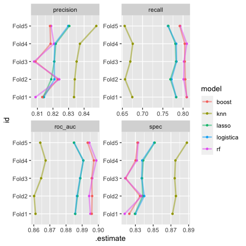

Nos gráficos, observa-se que o desempenho da floresta aleatória foi o
melhor em quase todas as métricas, ficando para trás apenas na
especificidade.

## 4.2. Curva ROC

``` r
results_train_sample <- log_res %>% 
  unnest(.predictions) %>% 
  mutate(model = "logistica") %>% 
  bind_rows(knn_res %>% 
            unnest(.predictions) %>% 
            mutate(model = "knn")) %>%
  bind_rows(lasso_res %>% 
            unnest(.predictions) %>% 
            mutate(model = "lasso")) %>%
  bind_rows(rf_res %>% 
            unnest(.predictions) %>% 
            mutate(model = "random forest")) %>% 
  bind_rows(boost_res %>% 
            unnest(.predictions) %>% 
            mutate(model = "boosting"))
  
  results_train_sample %>% 
  group_by(model) %>% 
  roc_curve(Resposta, .pred_Alto) %>% 
  autoplot()
```

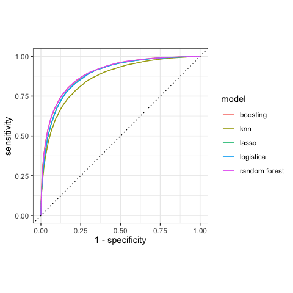

``` r
curva_roc <- log_res %>% 
  collect_metrics() %>% 
  filter(.metric == 'roc_auc') %>% 
  mutate(model = "logistica") %>% 
bind_rows(lasso_res %>% 
  collect_metrics() %>% 
  filter(.metric == 'roc_auc') %>% 
  mutate(model = "lasso")) %>%
bind_rows(knn_res %>% 
  collect_metrics() %>% 
  filter(.metric == 'roc_auc')%>% 
  mutate(model = "knn")) %>% 
bind_rows(rf_res %>% 
  collect_metrics() %>% 
  filter(.metric == 'roc_auc')%>% 
  mutate(model = "random forest")) %>% 
bind_rows(boost_res %>% 
  collect_metrics() %>% 
  filter(.metric == 'roc_auc')%>% 
  mutate(model = "boosting"))
  

curva_roc[order(curva_roc$mean, decreasing = TRUE),] 
```

    ## # A tibble: 5 x 6
    ##   .metric .estimator  mean     n  std_err model        
    ##   <chr>   <chr>      <dbl> <int>    <dbl> <chr>        
    ## 1 roc_auc binary     0.896     5 0.000822 random forest
    ## 2 roc_auc binary     0.896     5 0.000634 boosting     
    ## 3 roc_auc binary     0.887     5 0.00106  lasso        
    ## 4 roc_auc binary     0.887     5 0.00104  logistica    
    ## 5 roc_auc binary     0.863     5 0.00128  knn

Como já havia sido constatado anteriormente pelo gráfico da curva ROC e
como ser observado na tabela acima, o melhor modelo é a floresta
aleatória. Em segundo lugar ficou boosting, seguido pela regressão
logística e lasso, praticamente empatados. Como o KNN foi o pior modelo
e exige muito tempo para rodar, não será ajustado na base completa.

## 4.3. Seleção do melhor modelo

### 4.3.1. Ajuste na base de treino completa

Com todos os modelos calibrados, é feito o ajuste na base de treino
completa:

``` r
doParallel::registerDoParallel(cores = 6)

log_fit <- log_spec %>% 
      fit(Resposta ~.,
      data = train_baked)

lasso_fit <- lasso_final %>% 
            fit(Resposta ~.,
            data = train_baked)

rf_fit <- rf_final %>% 
      fit(Resposta ~.,
      data = train_baked)

boost_fit <- boost_final %>% 
      fit(Resposta ~.,
      data = train_baked)
```

### 4.3.1.1. Resultados na base de treino

A comparação da curva ROC nos resultados da base de treino mostra mais
uma vez a melhor performance do random forest.

``` r
results_train <- log_fit %>% 
  predict(new_data = train_baked, type = 'prob') %>% 
  mutate(truth = train_baked$Resposta,
         model = 'logistica') %>% 
  bind_rows(lasso_fit %>% 
  predict(new_data = train_baked, type = 'prob') %>% 
  mutate(truth = train_baked$Resposta,
         model = 'lasso')) %>% 
  bind_rows(rf_fit %>% 
  predict(new_data = train_baked, type = 'prob') %>% 
  mutate(truth = train_baked$Resposta,
         model = 'random forest')) %>% 
  bind_rows(boost_fit %>% 
  predict(new_data = train_baked, type = 'prob') %>% 
  mutate(truth = train_baked$Resposta,
         model = 'boosting'))

results_train %>% 
  group_by(model) %>% 
  roc_curve(truth, .pred_Alto) %>% 
  autoplot()
```

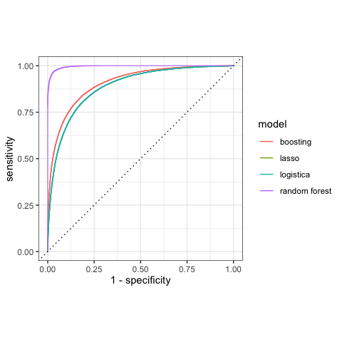

``` r
results_train %>% 
  group_by(model) %>% 
  roc_auc(truth, .pred_Alto) %>% 
  arrange(-.estimate)
```

    ## # A tibble: 4 x 4
    ##   model         .metric .estimator .estimate
    ##   <chr>         <chr>   <chr>          <dbl>
    ## 1 random forest roc_auc binary         0.996
    ## 2 boosting      roc_auc binary         0.908
    ## 3 logistica     roc_auc binary         0.888
    ## 4 lasso         roc_auc binary         0.887

``` r
results_train_class <- log_fit %>% 
  predict(new_data = train_baked, type = 'class') %>% 
  mutate(truth = train_baked$Resposta,
         model = 'logistica') %>% 
  bind_rows(lasso_fit %>% 
  predict(new_data = train_baked, type = 'class') %>% 
  mutate(truth = train_baked$Resposta,
         model = 'lasso')) %>% 
  bind_rows(rf_fit %>% 
  predict(new_data = train_baked, type = 'class') %>% 
  mutate(truth = train_baked$Resposta,
         model = 'random forest')) %>% 
  bind_rows(boost_fit %>% 
  predict(new_data = train_baked, type = 'class') %>% 
  mutate(truth = train_baked$Resposta,
         model = 'boosting'))

cm_train <- results_train_class %>% 
  group_by(model) %>% 
  conf_mat(truth, .pred_class) %>% 
  mutate(info = map(conf_mat, summary)) %>% 
  unnest(info) %>% 
  filter(.metric == 'spec'|.metric == 'recall'|.metric == 'precision')
```

Na base de treino, o melhor modelo foi a floresta aleatória.

### 4.3.2. Importância das variáveis

#### 4.3.2.1. Regressão Logística

``` r
log_var <- log_fit %>% 
  vi() %>% 
  mutate(Importance_pct = abs(Importance)/max(abs(Importance))) %>% 
  mutate(Variable = fct_reorder(Variable, Importance_pct)) 


log_var %>% 
  filter(Importance_pct > 0.05) %>% 
  ggplot(aes(Variable, Importance_pct, color = Sign)) +
  geom_point() +
  coord_flip()
```

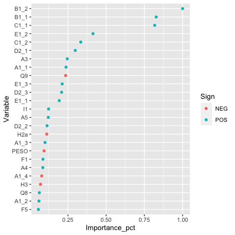

As variáveis ligadas à pesquisa de satisfação tiveram maior peso nesse
modelo. A mais importante foi se a operadora cumpre o prometido, seguida
da facilidade de entender os planos. Em terceiro aparece a capacidade de
fazer ligações e em quarto a clareza da conta. Em quinto, a qualidade
das ligações.

#### 4.3.2.2. Lasso

``` r
lasso_fit %>% 
  tidy %>% 
  filter(term != "", class == "Alto") %>% 
  #arrange(term, lambda) %>% 
  #mutate(log.lambda = log(lambda)) %>% 
  #filter(step <=10) %>% 
  #filter(estimate < 0.2) %>% 
  ggplot(aes(lambda, estimate, color = term, group = term)) +
  scale_x_log10() +
  geom_line(show.legend = FALSE)
```

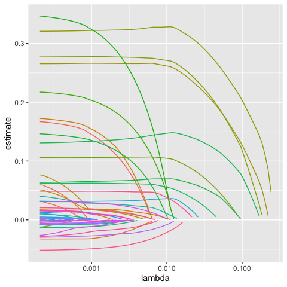

``` r
  #geom_point(show.legend = FALSE)

lasso_var <- lasso_fit %>%
  vi() %>% 
  mutate(Importance_pct = abs(Importance)/max(abs(Importance))) %>% 
  mutate(Variable = fct_reorder(Variable, Importance_pct))

#Verificaçãoda seleção das variáveis
lasso_var %>% 
  count(Importance_pct == 0)
```

    ## # A tibble: 2 x 2
    ##   `Importance_pct == 0`     n
    ##   <lgl>                 <int>
    ## 1 FALSE                    51
    ## 2 TRUE                     12

``` r
lasso_var %>% 
  filter(Importance_pct > 0.05) %>% 
  ggplot(aes(Variable,Importance_pct, color = Sign)) +
  geom_point()+
  scale_y_continuous(labels = scales::percent_format()) +
  coord_flip()
```

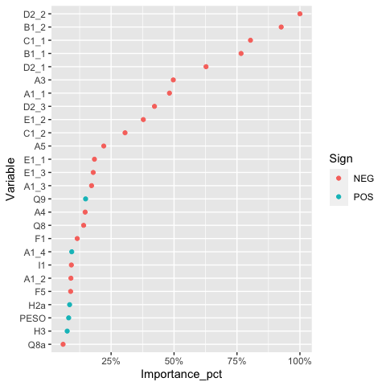

No primeiro gráfico, é possível observar a selação das variáveis com a
variaçao do lambda. A legenda foi omitida para facilitar a visualização.
Das cinco variáveis mais importantes, três também estavam presentes na
regressão logística. Nota-se no entanto, que possuem o coeficiente
negativo.

#### 4.3.2.3. Random Forest

``` r
rf_var <- vi(rf_fit) %>% 
  mutate(Importance_pct = abs(Importance)/max(abs(Importance))) %>% 
  mutate(Variable = fct_reorder(Variable, Importance_pct))

rf_var %>% 
  filter(Importance_pct > 0.05) %>% 
  ggplot(aes(Variable, Importance_pct)) +
  geom_point()+
  scale_y_continuous(labels = scales::percent_format())+
  coord_flip()
```

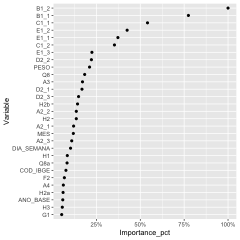

O resultado foi bastante semelhante à regressão logística. As cinco
primeiras posições se repetiram.

#### 4.3.2.4. Boosting

``` r
boost_var <- vi(boost_fit) %>% 
  mutate(Importance_pct = abs(Importance)/max(abs(Importance))) %>% 
  mutate(Variable = fct_reorder(Variable, Importance_pct))
```

    ## Warning: `as.tibble()` is deprecated as of tibble 2.0.0.
    ## Please use `as_tibble()` instead.
    ## The signature and semantics have changed, see `?as_tibble`.
    ## This warning is displayed once every 8 hours.
    ## Call `lifecycle::last_warnings()` to see where this warning was generated.

``` r
boost_var %>% 
  filter(Importance_pct > 0.005) %>% 
  ggplot(aes(Variable, Importance_pct)) +
  geom_point()+
  scale_y_continuous(labels = scales::percent_format())+
  coord_flip()
```

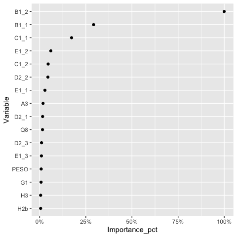

Assim como na floresta aleatória, as princnipais variáveis estavam
presentes nos modelos anteriores.

#### 4.3.2.5.Comparação:

A seguir, é possível observar as varíaveis em comum nos modelos:

``` r
var_imp <- log_var %>% 
  mutate(model = 'logistica') %>% 
  bind_rows(lasso_var %>% 
            mutate(model = 'lasso')) %>% 
  bind_rows(rf_var %>% 
             mutate(Sign ='POS',
             model = 'random forest')) %>% 
  #bind_rows(boost_var %>% 
  #          mutate(Sign ='POS',
  #          model = 'boosting')) %>%
  arrange(-Importance_pct)
  
var_imp %>% 
  filter(Importance_pct > 0.1) %>% 
  group_by(model) %>% 
  ggplot(aes(Variable, Importance_pct, color = model)) +
  geom_point(alpha = 0.7) +
  scale_y_continuous(labels = scales::percent_format()) +
  coord_flip()
```

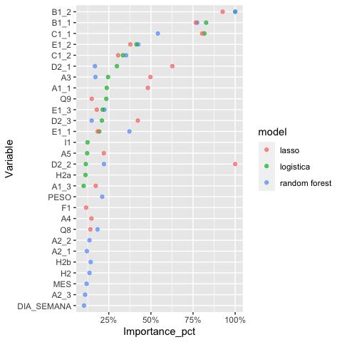

Para melhorar a visualização, foram filtradas variáveis com importância
maior que 10%. Pelo fato de boosting possuir apenas três variáveis com
importância acima desse valor, foi omitido do gráfico.

### 4.3.3. Performance na base de teste:

``` r
results_test <- log_fit %>% 
  predict(new_data = test_baked, type = 'prob') %>% 
  mutate(truth = test_baked$Resposta,
         model = 'logistica',
         #correct = case_when(truth == .pred_class ~ "Correct", TRUE ~ "Incorrect")
         ) %>% 
   bind_rows(lasso_fit %>% 
      predict(new_data = test_baked, type = 'prob') %>% 
      mutate(truth = test_baked$Resposta,
              model = 'lasso',
              #correct = case_when(truth == .pred_class ~ "Correct", TRUE ~ "Incorrect")
             )) %>% 
  bind_rows(rf_fit %>% 
    predict(new_data = test_baked, type = 'prob') %>% 
    mutate(truth = test_baked$Resposta,
         model = 'random forest',
         #correct = case_when(truth == .pred_class ~ "Correct", TRUE ~ "Incorrect")
         )) %>% 
  bind_rows(boost_fit %>% 
    predict(new_data = test_baked, type = 'prob') %>% 
   mutate(truth = test_baked$Resposta,
         model = 'boosting',
         #correct = case_when(truth == .pred_class ~ "Correct", TRUE ~ "Incorrect")
         ))

results_test %>% 
  group_by(model) %>% 
  #filter(model == c('boosting','random forest') ) %>% 
  roc_curve(truth, .pred_Alto) %>% 
  autoplot()
```

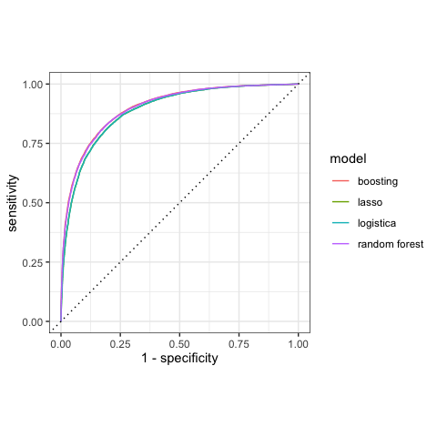

``` r
results_test %>% 
  group_by(model) %>% 
  roc_auc(truth, .pred_Alto) %>% 
  arrange(-.estimate)
```

    ## # A tibble: 4 x 4
    ##   model         .metric .estimator .estimate
    ##   <chr>         <chr>   <chr>          <dbl>
    ## 1 boosting      roc_auc binary         0.901
    ## 2 random forest roc_auc binary         0.899
    ## 3 lasso         roc_auc binary         0.889
    ## 4 logistica     roc_auc binary         0.889

Na base de teste, o modelo com maior área sob a curva ROC foi boosting.
Os demais modelos ficaram praticamente empatados. Para selecionar o
melhor modelo, as demais métricas serão analisadas:

``` r
results_test_class <- log_fit %>% 
  predict(new_data = test_baked, type = 'class') %>% 
  mutate(truth = test_baked$Resposta,
         model = 'logistica',
         #correct = case_when(truth == .pred_class ~ "Correct", TRUE ~ "Incorrect")
         ) %>% 
   bind_rows(lasso_fit %>% 
      predict(new_data = test_baked, type = 'class') %>% 
      mutate(truth = test_baked$Resposta,
              model = 'lasso',
              #correct = case_when(truth == .pred_class ~ "Correct", TRUE ~ "Incorrect")
             )) %>% 
  bind_rows(rf_fit %>% 
    predict(new_data = test_baked, type = 'class') %>% 
    mutate(truth = test_baked$Resposta,
         model = 'random forest',
         #correct = case_when(truth == .pred_class ~ "Correct", TRUE ~ "Incorrect")
         )) %>% 
  bind_rows(boost_fit %>% 
    predict(new_data = test_baked, type = 'class') %>% 
   mutate(truth = test_baked$Resposta,
         model = 'boosting',
         #correct = case_when(truth == .pred_class ~ "Correct", TRUE ~ "Incorrect")
         ))

cm_test <- results_test_class %>% 
  group_by(model) %>% 
  conf_mat(truth, .pred_class) %>% 
  mutate(info = map(conf_mat, summary)) %>% 
  unnest(info) %>% 
  filter(.metric == 'spec'|.metric == 'recall'|.metric == 'precision')
  
  cm_test %>% 
    mutate(train_test = 'test') %>% 
    bind_rows(cm_train %>% 
                mutate(train_test = 'train')) %>% 
  filter(model == 'boosting'| model == 'random forest') %>% 
  ggplot(aes(model, .estimate, color = train_test)) +
  geom_point(show.legend = TRUE) +
  facet_wrap(~.metric, nrow = 1) +
  theme(axis.text.x = element_text(angle = 90, hjust=1))
```

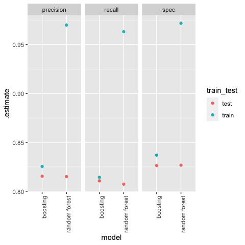

Como é possível observar, a floreta aleatória performou melhor em todas
as métricas na base de treino. Jã na base de teste a performance dos
modelos foi muito próxima, sendo boosting um pouco melhor, mas com uma
diferença insignificativa. Portanto, a floresta aleatória será
selecionada como o melhor modelo.

# 5\. Conclusão

A base de dados tratada em Python foi separada em treino e teste e foi
utilizado também cinco amostras via cross-validation para calibração dos
hiperparâmetros. Para otimizar o processamento de comparação, foi
selecionada uma amostra equivalente a 40% da base. Tendo os melhores
hiperparâmetros para cada modelo, fez-se o ajuste na base de treino
completa. A escolha do melhor modelo se deu por comparação do desempenho
nas seguintes métricas: área sob a curva ROC (roc\_auc), sensibilidade
(recall), especificidade (spec) e precisão (precision).

O modelo random forest apresentou os melhores resultados considerando
todas as métricas tanto para a base de treino e ficou praticamente
empatada com boosting na base de teste. Foi portanto, selecionado como o
melhor modelo. Para ajustá-lo, utilizou-se mtry = 7 e 500 árvores,
correspondente ao melhor número para sensitividade, especificidade e
precisão apurado pelo modelo. Em segundo lugar ficou o modelo boosting,
seguido pela regressão logística e lasso, praticamente empatadas.

Quanto à importância das variáveis nos modelos, as do tipo 2, ligadas à
notas para a pesquisa de satisfação, tiveram maior peso. A mais
importante foi se a operadora cumpre o prometido, seguido da facilidade
de entender os planos. Em terceiro aparece a capacidade de fazer
ligações e em quarto a clareza da conta. Em quinto, a qualidade das
ligações.

``` r
rf_fit$fit
```

    ## Ranger result
    ## 
    ## Call:
    ##  ranger::ranger(formula = formula, data = data, mtry = ~mtry_best,      num.trees = ~1000, importance = ~"impurity", num.threads = 1,      verbose = FALSE, seed = sample.int(10^5, 1), probability = TRUE) 
    ## 
    ## Type:                             Probability estimation 
    ## Number of trees:                  1000 
    ## Sample size:                      118227 
    ## Number of independent variables:  63 
    ## Mtry:                             7 
    ## Target node size:                 10 
    ## Variable importance mode:         impurity 
    ## Splitrule:                        gini 
    ## OOB prediction error (Brier s.):  0.1308058

# 6\. Referências

Como referências para o desenvolvimento deste relatório foram utilizadas
as seguintes fontes:

  - [An Introduction do Statistical Modelling - James, G. et.
    al.](http://faculty.marshall.usc.edu/gareth-james/ISL/ISLR%20Seventh%20Printing.pdf)
    [The Elements of Statistical Learning - Hastie, T. et.
    al.](https://web.stanford.edu/~hastie/ElemStatLearn/printings/ESLII_print12.pdf)

  - Material de aula do curso Modelos Preditivos - Insper - 2020

  - [Introdução a Tidymodels - Mendonça,
    T.](https://www.tiagoms.com/post/tidymodels/)

  - Julia Silge - Blog e
    [YouTube](https://www.youtube.com/channel/UCTTBgWyJl2HrrhQOOc710kA)
    
      - [Preprocessing and resampling using \#TidyTuesday college
        data](https://juliasilge.com/blog/tuition-resampling/)
    
      - [LASSO regression using tidymodels and \#TidyTuesday data for
        The Office](https://juliasilge.com/blog/lasso-the-office/)
    
      - [Tuning random forest hyperparameters with \#TidyTuesday trees
        data](https://juliasilge.com/blog/sf-trees-random-tuning/)
    
      - [\#TidyTuesday hotel bookings and
        recipes](https://juliasilge.com/blog/hotels-recipes/)
    
      - [\#TidyTuesday and
        tidymodels](https://juliasilge.com/blog/intro-tidymodels/)

  - [Tidymodels documentation](https://tidymodels.github.io/tidymodels/)

  - [Base de dados
    original](http://www.dados.gov.br/dataset/banco-de-dados-da-pesquisa-telefonia-movel-pre-paga)
